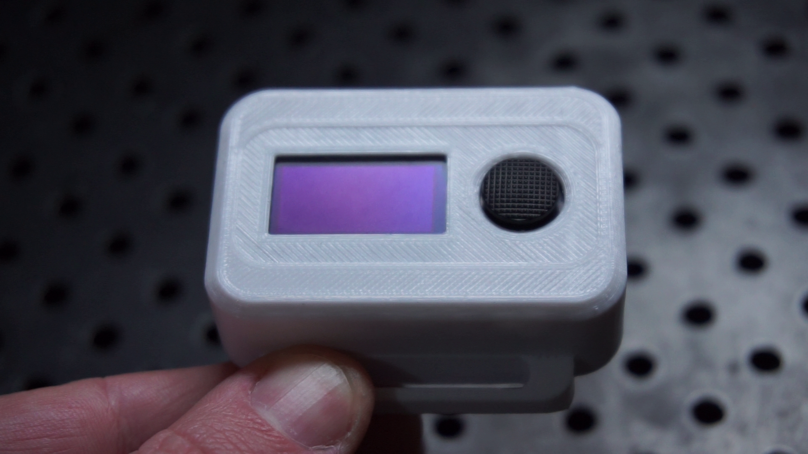

# GGIWATCH23
picoW/micropython based, 3d printed, internet capable digital watch
created by CARBONTE LTD. 2023 and released under the MIT licence.

for building instructions check out this youtube video or alternatively browse
the parts section of this build: https://www.youtube.com/watch?v=fSmTCypNuMk

